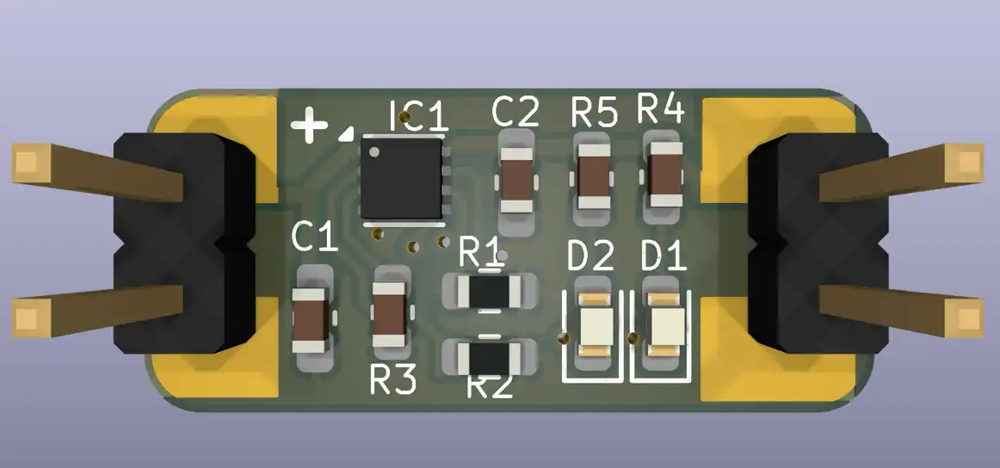

Tiny battery charger featuring BQ25170.
Output voltage and current programmable through resistors.

|      |           |
|------|-----------|
| Vin  | 3..6V     |
| Vout | 3.5..4.4V |
| Iout | 10..800mA |

* LiFePO4: 3.5 V, 3.6 V, 3.7 V
* Li-Ion:  4.05 V, 4.1 V, 4.2 V, 4.35 V, 4.4 V
* Na-ion (Sodium)




```
R1 (Vset)
3.6V	82k
3.7V	62k
4.1V	36k
4.2V	27k
```


```
R2 (Iset)
800mA	375Ω
500mA	600Ω
```
